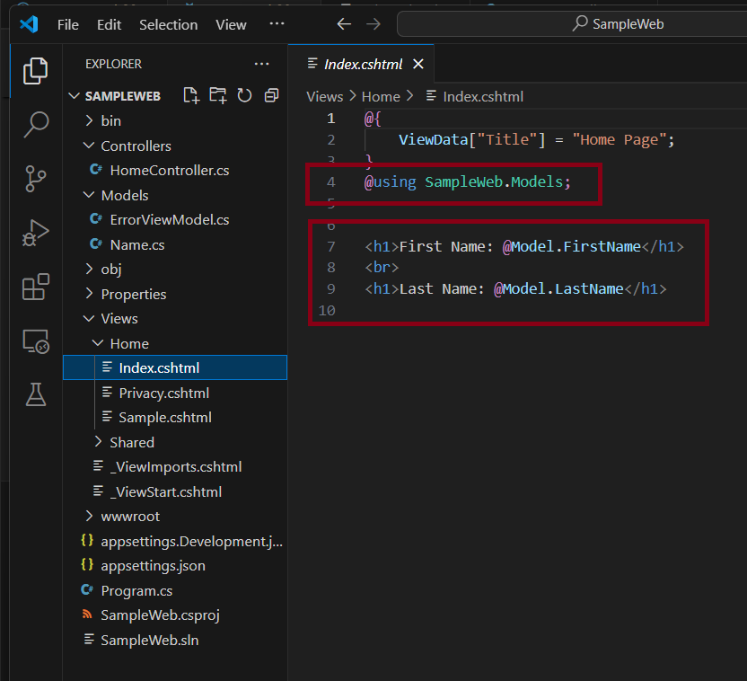

# Day 2 Lesson

### :bulb: Scope
 - Creating .NET core web app
 - Controllers in .NET MVC
 - Views and Razor Syntax
 - Model and Data Access

### :hammer_and_wrench: Creating .NET Core Web App

 1. Open Visual Studio Code in your machine.
 2. Press *CTRL+SHIFT+P*.
 3. Select *.NET: New Project*
    
    

 4. Select *ASP.NET Core Web App (Model-View-Controller) Web, MVC*.
 5. Set the project name and select a path to save the new project.

### Controllers in .NET MVC

 A controller is responsible for controlling the way that a user interacts with an MVC application. A controller contains the flow control logic for an ASP.NET MVC application. A controller determines what response to send back to a user when a user makes a browser request.

 A controller is just a class (for example, a Visual Basic or C# class) that is stored in the Controller folder

 ```c#
    using System.Diagnostics;
    using Microsoft.AspNetCore.Mvc;
    using SampleWeb.Models;

    namespace SampleWeb.Controllers;

    public class HomeController : Controller
    {
        public IActionResult Index()
        {
            return View();
        }
    }

 ```

### Git Basic Commands

    ```
    // add all changes in all files
    git add .

    // commit changes in a branch
    git commit -m "<your comment>"

    // push your changes to the main branch
    git push -u origin main

    // create new branch
    git checkout -b name-of-the-branch
    
    ```

### Creating new

 All model class should be in the model folder

 

 Create Instance of Model

 

 Display the instanciated data in the view

 

 You must add the model directory first like in line 4. and access the data using @Model like in line 7 and 9.
 